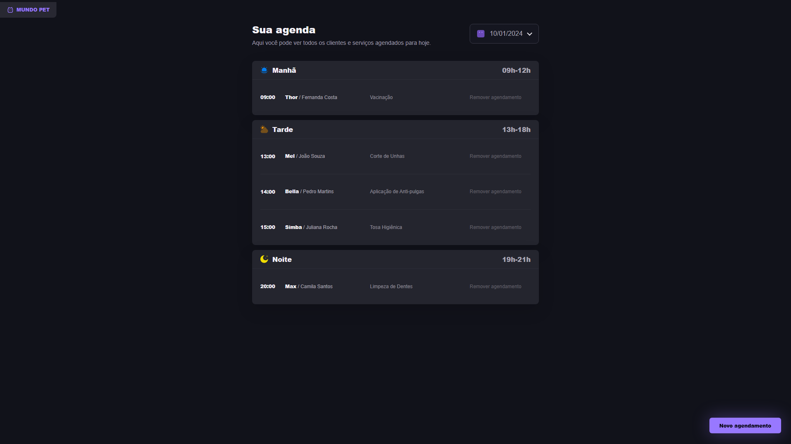
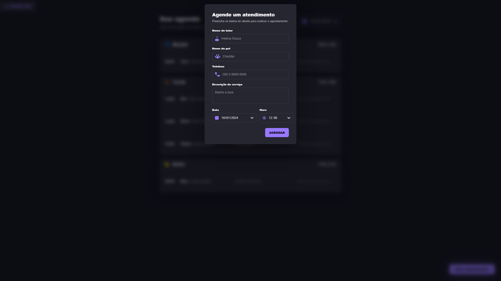

# Mundo Pet Agendamento


Aplicação web para gerenciamento de agendamentos de um pet shop. O projeto organiza atendimentos por período do dia, permite cadastrar novos horários e remover agendamentos em uma interface escura, responsiva e focada em produtividade.

## Demo

Acesse a versão online:

[https://luanagimns.github.io/agenda-pet/](https://luanagimns.github.io/agenda-pet/)

> Na demo publicada no GitHub Pages, os dados são salvos no navegador com `localStorage`. Ao executar localmente, a aplicação utiliza uma API Node.js com Express.

## Screenshots

### Agenda



### Novo agendamento



## Funcionalidades

- Visualização de agendamentos por data.
- Organização automática por período: manhã, tarde e noite.
- Cadastro de tutor, pet, telefone, serviço, data e horário.
- Máscara de telefone durante o preenchimento.
- Remoção de agendamentos.
- Persistência local na demo estática via `localStorage`.
- API local com rotas REST para listagem, criação e exclusão.
- Interface responsiva com modal de cadastro.

## Tecnologias

- HTML5
- CSS3
- JavaScript
- Node.js
- Express

## Como Rodar Localmente

Clone o repositório:

```bash
git clone https://github.com/luanagimns/agenda-pet.git
cd agenda-pet
```

Instale as dependências:

```bash
npm install
```

Inicie o servidor:

```bash
npm start
```

Acesse no navegador:

```text
http://localhost:3000
```

## Scripts Disponíveis

| Comando | Descrição |
| --- | --- |
| `npm start` | Inicia o servidor Express |
| `npm run dev` | Inicia o servidor em modo de desenvolvimento |

## API

| Método | Rota | Descrição |
| --- | --- | --- |
| `GET` | `/api/appointments` | Lista todos os agendamentos |
| `GET` | `/api/appointments?date=2024-01-10` | Lista agendamentos filtrados por data |
| `POST` | `/api/appointments` | Cria um novo agendamento |
| `DELETE` | `/api/appointments/:id` | Remove um agendamento pelo ID |

### Exemplo de Cadastro

```json
{
  "tutor": "Helena Souza",
  "pet": "Cheddar",
  "phone": "(16) 99999-9999",
  "service": "Banho e tosa",
  "date": "2024-01-10",
  "time": "12:00"
}
```

## Estrutura do Projeto

```text
agenda-pet/
+-- assets/
|   +-- screenshots/
|   +-- *.svg
+-- index.html
+-- script.js
+-- server.js
+-- style.css
+-- package.json
+-- package-lock.json
+-- README.md
```

## Decisões Técnicas

- A API local mantém os dados em memória para simplificar a execução do projeto.
- A demo do GitHub Pages usa `localStorage`, já que o GitHub Pages não executa backend Node.js.
- O frontend detecta automaticamente o ambiente: em `localhost`, consome a API; em produção estática, usa armazenamento local.

## Observações

Os agendamentos criados localmente pela API são perdidos ao reiniciar o servidor, pois ainda não há banco de dados persistente. Para uma evolução futura, o projeto pode receber persistência em arquivo, SQLite, PostgreSQL ou MongoDB.

## Autora

Desenvolvido por [Luana Gimenes](https://github.com/luanagimns).
